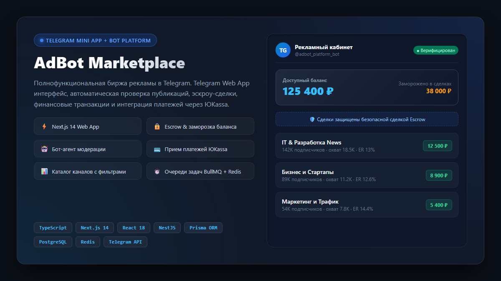
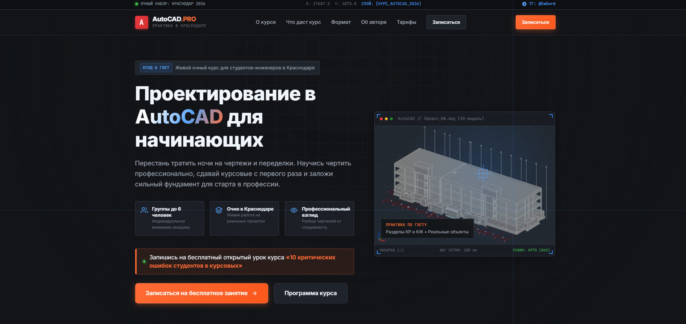
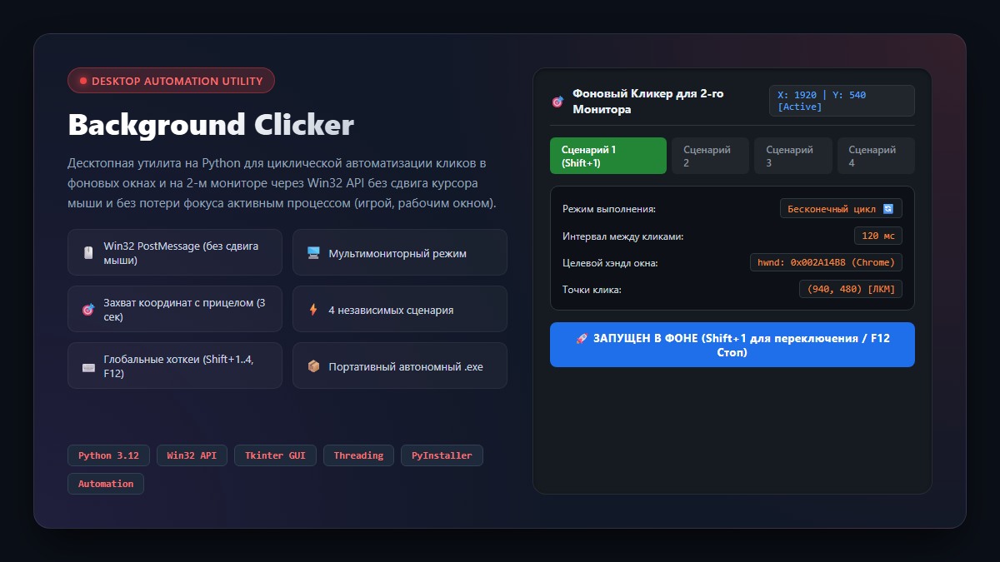
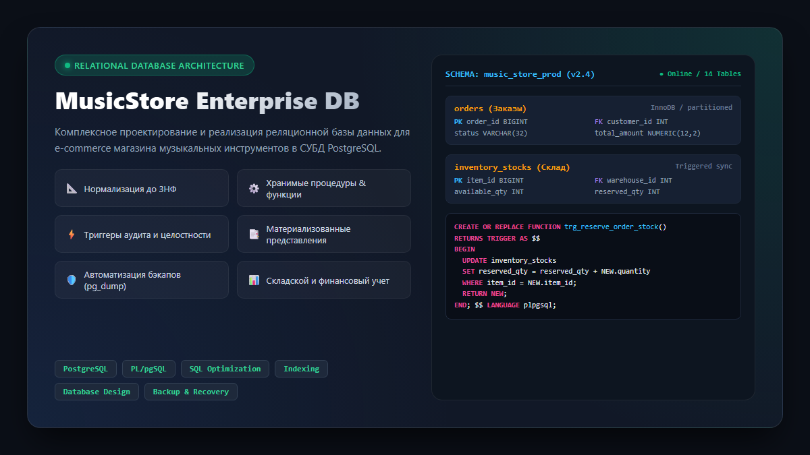
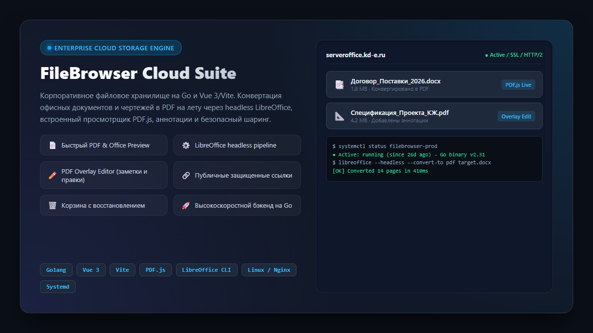
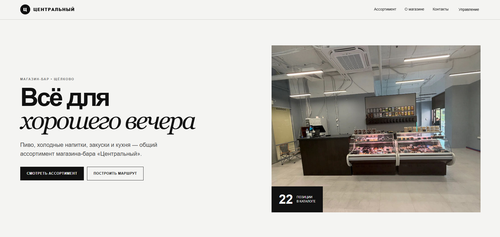
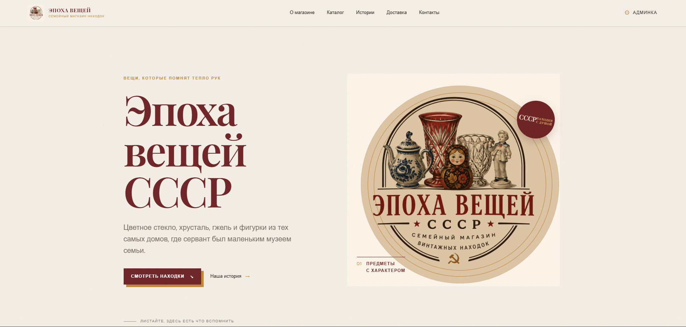
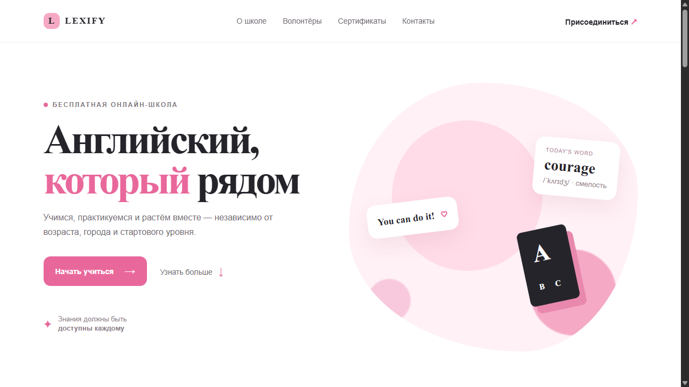
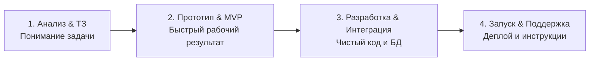

# 👋 Привет! Я Юрий Соколов (Nuar)
### Full-Stack разработчик · Telegram Mini Apps · Веб-сервисы · Автоматизация бизнеса

  Разрабатываю цифровые продукты «под ключ»: от интерактивных <strong>Telegram Mini Apps</strong> и конверсионных <strong>лендингов</strong> до <strong>высоконагруженных баз данных</strong> и <strong>десктопных утилит автоматизации</strong>.

---

## 🛠️ Технологический стек

| Категория | Технологии и инструменты |
| :--- | :--- |
| **Frontend & Web Apps** |       |
| **Backend & APIs** |      |
| **Telegram & Боты** |    |
| **Базы данных & Очереди** |      |
| **Системное & Автоматизация** |      |
| **Платежи & Интеграции** |    |

---

## 🏆 Избранные проекты и кейсы

### 1. 📱 AdBot Marketplace & Telegram Mini App
> **Полнофункциональная биржа рекламы в Telegram с веб-интерфейсом (TMA), ботом и безопасной сделкой (Escrow)**

- **Задача:** Разработать безопасную платформу для автоматизированной покупки и продажи рекламы в каналах Telegram без риска обмана со стороны рекламодателей и блогеров.
- **Что реализовано:**
  - **Telegram Mini App (TMA):** Реактивный адаптивный кабинет рекламодателя и владельца каналов на **Next.js 14 / React 18 / TypeScript**.
  - **Эскроу-ядро & Финансы:** Двусторонняя бухгалтерская модель счетов (`FinancialTransaction`), заморозка баланса при бронировании и автовыплата после верификации поста.
  - **Платежи:** Интеграция с эквайрингом **ЮKassa** с идемпотентной обработкой вебхуков и логированием.
  - **Очереди и надежность:** Фоновые задачи на **Redis + BullMQ** для таймеров публикации, автопроверки выходов постов и автозавершения сделок.
  - **Стек:** `Next.js 14`, `React 18`, `TypeScript`, `NestJS`, `Prisma ORM`, `PostgreSQL`, `Redis`, `BullMQ`, `ЮKassa API`, `Telegram Bot API`.

---

### 2. 🎯 AutoCAD.PRO — Лендинг инженерных курсов в Краснодаре
> **Высококонверсионный адаптивный сайт для набора студентов на очное обучение черчению**

- **Задача:** Создать стильный промо-сайт в строгой инженерной стилистике CAD-систем для привлечения студентов профильных вузов Краснодара на очные курсы.
- **Что реализовано:**
  - Инженерный Dark-UI с акцентной неоновой типографикой, сеткой чертежей и интерактивной 3D-изометрией конструкции здания (разделы КР/КЖ).
  - Проработанная структура воронки: выгоды курса, программа занятий, разбор преподавателя, карточки тарифов и форма записи на бесплатный пробный урок.
  - Адаптивная мобильная верстка с плавной прокруткой и быстрой загрузкой (<1 сек) без тяжелых зависимостей.
  - **Стек:** `HTML5`, `CSS3 (Flexbox/Grid)`, `Modern JavaScript`, `Dark Engineering UI`, `Responsive Design`.

---

### 3. 🖱️ Background Clicker — Win32 Desktop Automation Tool
> **Десктопная утилита с GUI для автоматизации фоновых кликов на мультимониторных рабочих станциях**

- **Задача:** Реализовать циклический автокликер для работы на втором мониторе, который **не перехватывает курсор мыши** и **не сбивает фокус** активного окна (например, игры или рабочей IDE).
- **Что реализовано:**
  - Низкоуровневая эмуляция кликов через Win32 API (`PostMessage(hwnd, WM_LBUTTONDOWN / UP)`), позволяющая нажимать интерфейс свернутых или фоновых окон.
  - Графический интерфейс на **Tkinter** с темной темой, вкладками под 4 независимых сценария, таймером захвата координат (3 секунды) и живым трекером мыши.
  - Глобальные системные горячие клавиши (`Shift + 1..4` — запуск сценариев, `F12` — аварийная остановка).
  - Сборка в автономный `.exe` без требования установки Python на машине заказчика.
  - **Стек:** `Python 3.12`, `Win32 API`, `Tkinter`, `Multithreading`, `PyInstaller`.

---

### 4. 🗄️ MusicStore Enterprise Database — Реляционная база данных
> **Проектирование и реализация промышленной архитектуры БД для интернет-магазина музыкальных инструментов**

- **Задача:** Разработать с нуля нормализованную базу данных для интернет-магазина с каталогом инструментов, корзинами, заказами, складским учетом и аудитом.
- **Что реализовано:**
  - Комплексная схема из 14 таблиц, нормализованная до **3-й нормальной формы (3NF)** с внешними ключами и ограничениями целостности (`CASCADE`, `CHECK`).
  - Комплекс **хранимых процедур и функций на PL/pgSQL** (автоматический расчет скидок, оформление заказа, резервирование остатков).
  - **Триггеры**: автоматическое списание со склада, валидация цен, логирование истории изменений статусов.
  - Материализованные представления для ускорения генерации аналитических отчетов руководства.
  - Автоматизированные скрипты создания бэкапов (`pg_dump`) и быстрого развертывания проекта.
  - **Стек:** `PostgreSQL 16`, `PL/pgSQL`, `Database Normalization (3NF)`, `Data Integrity Triggers`, `pg_dump`.

---

### 5. ☁️ FileBrowser Cloud Suite & Headless Document Engine
> **Корпоративное облачное хранилище с конвертацией документов на лету и веб-просмотром**

- **Задача:** Кастомизация и сопровождение корпоративного файлового сервера на Linux (`serveroffice.kd-e.ru`) для работы с договорами, чертежами и сметами.
- **Что реализовано:**
  - Доработка ядра **FileBrowser (Golang)** и клиентского SPA на **Vue 3 / Vite**.
  - Пайплайн фоновой конвертации файлов Word/Excel/LibreOffice в PDF на лету через headless LibreOffice CLI.
  - Интеграция быстрого веб-просмотрщика **PDF.js** с мобильной оптимизацией.
  - Экспериментальный модуль **PDF Overlay Editor** (нанесение пометок и подписей прямо в браузере).
  - Корзина с безопасным восстановлением, защищенные публичные ссылки, отметка последнего файла.
  - Настройка Linux-окружения: Nginx reverse proxy, SSL Let's Encrypt, systemd демоны.
  - **Стек:** `Golang`, `Vue 3`, `Vite`, `PDF.js`, `LibreOffice Headless`, `Linux (Ubuntu)`, `Nginx`, `Systemd`.

---

### 6. 🏪 Магазин-бар «Центральный» в Щёлково
> **Каталог товаров с адаптивным интерфейсом и демо-админкой**

- **Задача:** Создать легкий, удобный веб-сайт для офлайн-магазина крафтовых напитков и кухни с возможностью просмотра ассортимента и контактов.
- **Что реализовано:**
  - Минималистичный премиальный дизайн в светлых тонах с акцентом на фотографии продукции.
  - Интерактивный фильтруемый каталог товаров с ценниками и описаниями.
  - Демо-панель управления ассортиментом для сотрудников.
  - Интеграция гео-точки и кнопки построения маршрута для покупателей.
  - **Репозиторий:** [`urasokolik/centralny-beer-shop`](https://github.com/urasokolik/centralny-beer-shop)
  - **Стек:** `HTML5`, `CSS3`, `JavaScript`, `Mobile-first UX`.

---

### 7. 🏺 «Эпоха вещей СССР» — Семейный магазин винтажных находок
> **Атмосферный интернет-магазин советского антиквариата с админкой Netlify CMS**

- **Задача:** Создать сайт для коллекционеров и любителей советской эстетики (хрусталь, цветное стекло, фарфор, фигурки) с удобным управлением товарами без необходимости трогать код.
- **Что реализовано:**
  - Уникальный винтажный визуальный стиль с аутентичной палитрой, авторскими иллюстрациями и шрифтами.
  - Интеграция с **Netlify CMS** — клиент самостоятельно загружает новые лоты, меняет статусы и публикует истории.
  - Разделы «О магазине», «Каталог», «Истории находок» и модуль доставки по всей России.
  - **Репозиторий:** [`urasokolik/epoha-veshchey-site`](https://github.com/urasokolik/epoha-veshchey-site)
  - **Стек:** `HTML5`, `CSS3`, `JavaScript`, `Netlify CMS`, `JAMstack`.

---

### 8. 🎓 Lexify — Волонтёрская онлайн-школа английского языка
> **Адаптивный образовательный лендинг с мягкой айдентикой**

- **Задача:** Разработать привлекательный, дружелюбный лендинг для бесплатной волонтёрской онлайн-школы английского языка.
- **Что реализовано:**
  - Чистый современный дизайн с плавными пастельными формами и акцентной типографикой.
  - Блоки с презентацией преподавателей-волонтёров, сертификатов и отзывов.
  - Высокая доступность и идеальная адаптация под смартфоны и планшеты.
  - **Живое демо:** [urasokolik.github.io/lexify-landing-page](https://urasokolik.github.io/lexify-landing-page/)
  - **Репозиторий:** [`urasokolik/lexify-landing-page`](https://github.com/urasokolik/lexify-landing-page)
  - **Стек:** `HTML5`, `CSS3`, `Responsive Design`, `GitHub Pages`.

---

### 9. 🤖 Telegram Opt-in Broadcast Bot
> **Сервис таргетированных рассылок для базы добровольных подписчиков**

- **Что реализовано:**
  - Полностью асинхронный бот на **Python (aiogram)** для взаимодействия с лояльной аудиторией.
  - База данных подписчиков на **SQLite**, функции сегментации, возможность паузы и возобновления массовых рассылок.
  - Защита от спама и блокировок Telegram: умные задержки между сообщениями и валидация доставки.
  - **Репозиторий:** [`urasokolik/telegram-opt-in-broadcast-bot`](https://github.com/urasokolik/telegram-opt-in-broadcast-bot)
  - **Стек:** `Python`, `aiogram`, `SQLite`, `Asyncio`.

---

## 💼 Как я работаю с клиентами

1. **Погружаюсь в бизнес-задачу:** Никакого лишнего оверинжиниринга — подбираю инструменты, которые решают задачу быстрее и надежнее всего.
2. **Всегда на связи:** Показываю промежуточные результаты, оперативно вношу правки и держу в курсе каждого этапа.
3. **Качество кода:** Код пишу структурированно, с документацией и инструкциями по запуску, чтобы проект можно было легко масштабировать.
4. **Сдача «под ключ»:** Не просто отдаю архив с файлами, а помогаю развернуть проект на сервере, настроить домен, SSL и подключить платежные сервисы.

---

## 📬 Готовы обсудить ваш проект?

Нужен сайт, Telegram-бот, Mini App или автоматизация рабочих процессов?  
Напишите мне — оперативно отвечу, сориентирую по срокам и стоимости!

